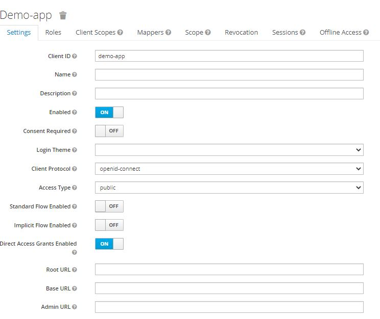

# backend-keycloak-with-Asp.Net-Core

## Install Keycloak.

```
docker run -p 8080:8080 -e KEYCLOAK_USER=admin -e KEYCLOAK_PASSWORD=admin quay.io/keycloak/keycloak:11.0.2
```

## Create Client in Keycloak.



## Authentication

1. Login

```powershell

# Login request
curl   -d "client_id=demo-app"   -d "username=admin"   -d "password=admin"   -d "grant_type=password"   "http://localhost:8080/auth/realms/master/protocol/openid-connect/token"
# response

{
   "access_token":"eyJhbGci ... uwqg",
   "expires_in":60,
   "refresh_expires_in":1800,
   "refresh_token":"eyJhbGci ... OamnQ",
   "token_type":"bearer",
   "not-before-policy":0,
   "session_state":"9156c143-ccce-4a5e-b00a-544322e27be5",
   "scope":"profile email"
}
```

2. Test the api from postman. We should copy the access token and paste in the parameter "Access Token"
   

- Commands:

```powershell
# login
curl \
  -d "client_id=admin-cli<cliente>" \
  -d "username=<usuario>" \
  -d "password=<password>" \
  -d "grant_type=password" \
  "http://localhost:8080/auth/realms/master/protocol/openid-connect/token"

# Get data from realm master
  curl \
  -H "Authorization: bearer <access-token>" \
  "http://localhost:8080/auth/admin/realms/master"

# Refresh token
  curl \
  -d "client_id=admin-cli" \
  -d "refresh_token=<refresh-token>" \
  -d "grant_type=refresh_token" \
  "http://localhost:8080/auth/realms/master/protocol/openid-connect/token"
```

**References**
https://www.albertcoronado.com/2020/10/06/identificacion-y-gestion-de-acceso-para-tus-aplicaciones-de-microservicios-con-keycloak-y-oauth2-proxy/
